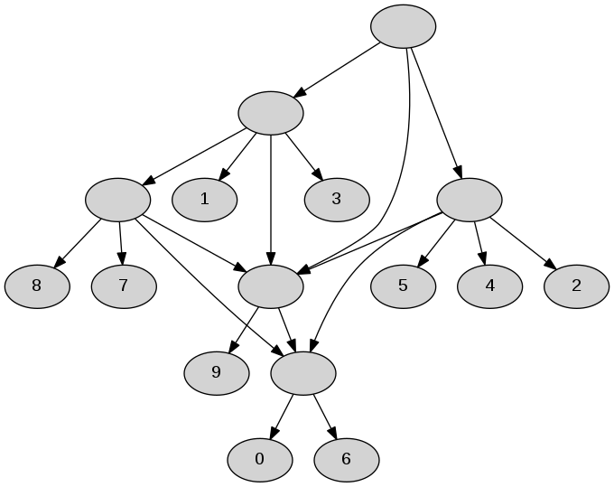
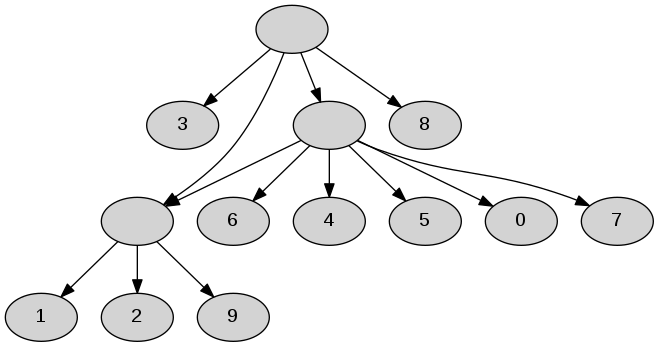

# Computing the Rooted Triplet Distance between Phylogenetic Networks

Problem: given two level-k networks N1 and N2 built on the same leaf label set of size λ, compute the rooted triplet distance between N1 and N2.

A sample generator for creating input networks is provided, as well as implementations of two different algorithms.

# Compilation

generator: g++ -O3 -std=c++11 -o generator generator.cpp

first approach: g++ -O3 -std=c++11 -o first first.cpp

second approach: g++ -O3 -std=c++11 -o second second.cpp

# Creating Sample Inputs

type ./generator λ p e outputFile

It creates a network N as follows:

1. Build a random rooted binary tree T on λ leaves following the uniform model. Let N = T.
2. Given a parameter 0 <= p <= 1, contract every internal node of N except the root of N with probability p. For a node w in N define d(w) to be the total number of edges in the path from the root of N to w.
3. Given a parameter e >= 0, add e random edges in N as follows. An edge u -> v is created in N if d(u) < d(v). If the total number of edges that can be added happens to be y, where y < e, then we only add those y edges.

# Running the algorithms

type ./first N1.txt N2.txt for the first approach and ./second N1.txt N2.txt for the second approach

The input format support right now for any network is as follows. Let N = (V,E) be a network built on a leaf label set of size λ. The network N is stored in N.txt. The first line contains |V| and the remaining |V| lines contain the adjacency list of N. Every leaf has a label in {0,1,...,λ-1}, the root of N has the label λ and every other internal node has a label in {λ+1, ..., |V|}.

output format: the output is the triplet distance between N1 and N2 as well as the CPU time (in seconds) taken to compute the triplet distance.

# Examples

./generator 10 0.2 5 N1.txt

./generator 10 0.8 5 N2.txt

./first N1.txt N2.txt

231	0.00226621

./second N1.txt N2.txt

231	0.00182754

